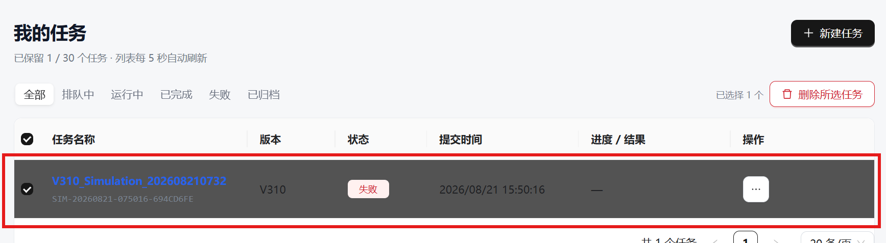

# “我的任务”列表不显示本地演示任务

> **Status:** Documented behavior

## 现象

任务详情 URL 可以访问，数据库中也存在任务，但 `/simulation/tasks` 的“我的任务”列表为空。

## 原因

任务列表会使用当前登录用户的 `userId` 作为 `owner_id` 查询条件：

```text
当前登录工号
  -> owner_id
  -> GET /api/simulation/tasks?owner_id=<工号>&archived=false
```

本地成功任务种子脚本默认创建 `owner_id=test-user`。如果页面使用其他工号登录，该任务不会出现在“我的任务”中。这是当前所有权过滤的预期行为。

## 解决方法

方法一：使用 `test-user` 登录本地页面。

方法二：按当前登录工号重新执行种子脚本：

```bash
cd backend
uv run python scripts/seed_local_completed_task.py \
  --trace-source /mnt/c/Users/zyp/Downloads/trace_sample.json \
  --owner-id <当前工号>
```

脚本会新增或更新同一 Task ID 的数据库记录，并同步更新 `summary.json` 中的 owner。

## 验证

```text
GET /api/simulation/tasks?owner_id=<当前工号>&archived=false&page=1&page_size=20
```

返回结果中应包含：

```text
SIM-20260818-024736-A3051FC3
```


